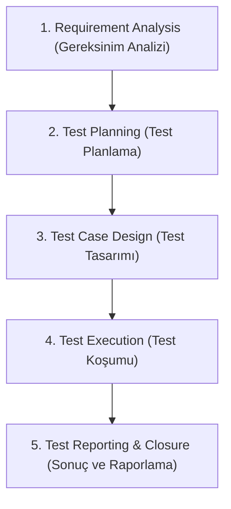

# E-Commerce App Yazılım Test ve Kalitesi Raporu

Bu rapor, geliştirilen E-Ticaret Sipariş Yönetim Sistemi projesinin yazılım test süreçlerini, uygulanan test stratejilerini, test case tasarımlarını ve kasıtlı olarak bırakılan hataların (bug) tespitine dair sonuçları içermektedir.

---

## 🔁 1. STLC (Software Testing Life Cycle) Süreci

Projede Yazılım Test Yaşam Döngüsü (STLC) adımları şu şekilde uygulanmıştır:

### 1.1. Requirement (Gereksinim Analizi)
Sistemin gereksinimleri analiz edilmiş ve aşağıdaki ana iş kuralları belirlenmiştir:
- **Sepet İşlemleri:** Kullanıcı sepete ürün ekleyebilmeli, miktar pozitif olmalı, sepet tutarı hesaplanabilmelidir.
- **Minimum Sipariş Limiti:** Siparişin tamamlanabilmesi için sepet tutarı en az **$20.00** olmalıdır.
- **Stok Kontrolü:** Sipariş verilmek istenen miktar, ürünün mevcut stok miktarını aşmamalıdır. Stokta olmayan veya yetersiz stoklu ürün sipariş edilememelidir.
- **İndirim Uygulaması:** "SAVE10" kodu sepet toplamına %10 indirim, "SAVE20" kodu ise %20 indirim uygulamalıdır.
- **Ödeme Entegrasyonu:** Ödeme başarısız olursa stoklar eski haline getirilmeli (rollback) ve sipariş iptal edilmelidir.

### 1.2. Test Plan (Test Planı)
- **Kapsam:** `Core/Product.cs`, `Core/Cart.cs` ve `Core/OrderService.cs` modüllerinin doğruluğu test edilecektir.
- **Test Türleri:** Birim Test (Unit - White Box), Kara Kutu (Black Box), Gri Kutu (Gray Box) ve Entegrasyon (Integration) testleri yapılacaktır.
- **Ortam & Araçlar:** .NET 10 Core, C# dili ve **NUnit 4** test kütüphanesi kullanılacaktır.
- **Kriterler:** En az 20 adet test case yazılacak, Equivalence Partitioning (EP) ve Boundary Value Analysis (BVA) teknikleri kullanılacaktır. Kasıtlı eklenen bug'ların testler tarafından yakalanması (yani testlerin fail olması) sağlanacaktır.

### 1.3. Test Design (Test Tasarımı)
Test case tasarımlarında girdiler ve çıktılar için geçerli, geçersiz ve sınır durumlar (BVA) analiz edilmiştir:
- **Eşdeğerlik Bölümleme (EP):** Sipariş toplamı için $[0, 19.99]$ (geçersiz aralık) ve $[20.00, \infty)$ (geçerli aralık) olarak bölünmüştür.
- **Sınır Değer Analizi (BVA):** Minimum sipariş tutarı olan $20.00 için sınır değerler $19.99 (geçersiz sınır), $20.00 (geçerli sınır) ve $20.01 (geçerli) olarak test edilmiştir. Aynı yaklaşım stok miktarları (0, 1, max) ve indirim oranları için de uygulanmıştır.

### 1.4. Test Execution (Test Koşumu)
Yazılan test senaryoları `dotnet test` komutu çalıştırılarak otomatik test koşum aracılığıyla koşturulmuştur. Testlerin çalıştırılması esnasında sisteme yerleştirilen bug'lar nedeniyle bazı testlerin beklendiği gibi başarısız (Fail) olması gözlemlenmiştir.

### 1.5. Test Result & Reporting (Test Sonuçları ve Raporlama)
Test sonuçları bu md rapor dosyası üzerinde toplanmış, tespit edilen bug'lar listelenmiş ve yazılım kalitesi açısından sistem değerlendirilmiştir.

---

## ⚠️ 2. Hata Kavramları ve Projeden Örnekler

Yazılım test literatüründeki temel hata terimlerinin tanımları ve bu projedeki somut karşılıkları aşağıda sunulmuştur:

| Kavram | Tanım | Projedeki Örnek |
| :--- | :--- | :--- |
| **Error (Hata)** | Yazılımcının kod yazarken, analiz yaparken ya da tasarım yaparken yaptığı insan kaynaklı yanlışlık/hata. | Geliştiricinin indirim oranını atarken yanlışlıkla `0.10` yerine `0.50` yazması veya stok kontrol koşulunu yazarken opertörü karıştırması. |
| **Fault (Kusur / Defect)** | Geliştiricinin yaptığı hata (error) sonucu kod içerisinde ortaya çıkan eksiklik, yanlış satır ya da mantıksal kusur. | `OrderService.cs` satır 83'teki `discountPercent = 0.50m;` ifadesi ya da satır 41'deki `item.Product.Stock < 0` koşulu birer fault'tur. |
| **Failure (Başarısızlık)** | Kusurlu kodun (fault) çalıştırılması sonucu, sistemin çalışma zamanında (runtime) gereksinimlere aykırı veya yanlış davranış göstermesi. | Uygulama çalışırken $100'lık ürüne "SAVE10" indirim kodu uygulandığında ödenmesi gereken tutarın $90 yerine $50 olarak hesaplanıp tahsil edilmesi. |
| **Bug / Defect** | Sistemde tespit edilen ve düzeltilmesi gereken tüm hatalı durumların genel adı. | Stokta hiç ürün kalmamışken siparişin başarılı şekilde onaylanması ve stok değerinin negatif (-1) seviyeye inmesi durumu bir bug'dır. |

---

## 📈 3. Test Stratejileri

Projelerde kalite standartlarını sağlamak amacıyla uygulanan test stratejileri aşağıda özetlenmiştir:

### 3.1. Agile Testing (Çevik Test)
Yazılım testinin sürecin en son aşamasında değil, geliştirme süreciyle paralel olarak (erken aşamada) yürütülmesini savunan yaklaşımdır. Geliştiriciler ve test uzmanları sürekli iletişim halindedir. Bu projede, kod yazılırken eş zamanlı birim testlerin yazılması ve koşulması Agile Testing anlayışını yansıtır.

### 3.2. Risk-Based Testing (Riske Dayalı Test)
Zaman ve kaynak kısıtları nedeniyle testlerin sistemin en kritik ve hata yapılması durumunda en büyük zarara yol açacak modüllerine odaklanmasıdır. E-ticaret sistemlerinde en kritik riskli alanlar **Ödeme Altyapısı, Stok Takibi ve Fiyatlandırma/İndirim** modülleridir. Projede test dağılımının bu kritik senaryolara odaklanması bu stratejinin bir parçasıdır.

### 3.3. Regression Testing (Regresyon Testi)
Sistemde yapılan bir değişiklik, hata düzeltmesi veya yeni özellik eklenmesi sonrasında, mevcut çalışan sistemin diğer yerlerinin bozulup bozulmadığını kontrol etmek için yapılan test koşumlarıdır. Projede oluşturulan otomatik NUnit test suite'i, ilerleyen aşamalarda bug'lar fixlendiğinde regression test seti olarak koşularak diğer fonksiyonların güvenliğini sağlayacaktır.

---

## 🧪 4. Test Türleri

Projede kullanılan 4 farklı test türünün kapsamı:

1. **Unit Test (White Box):** Kodun iç yapısı, döngüleri, dallanmaları ve değişken tipleri bilinerek yazılır. `Product` sınıfının constructor'ı ve `Cart` sınıfının sepet işlemleri doğrudan kod seviyesinde test edilmiştir.
2. **Black Box Test:** Kodun iç yapısı tamamen göz ardı edilerek, sadece gereksinimlere dayalı (input-output) testler yapılır. E-ticaret sipariş verme mekanizması sınır değerler baz alınarak test edilmiştir.
3. **Gray Box Test:** Hem kod yapısı kısmen bilinir hem de fonksiyonel testler yapılır. Siparişin verilmesi (Black Box giriş) sonrasında, ürünlerin stok tablosundaki miktar değişimi ve nesne durumları (Gray Box) kontrol edilir.
4. **Integration Test:** Farklı modüllerin (`Product`, `Cart`, `OrderService` ve ödeme simülatörü) bir arada uyum içinde çalışıp çalışmadığı entegre şekilde test edilir.

---

## 📊 5. Test Summary (Test Özeti)

Otomatik test koşumu sonucunda elde edilen veriler:

- **Toplam Çalıştırılan Test Durumu (Test Cases):** 24
- **Başarılı Olan Test Sayısı (Passed):** 20
- **Başarısız Olan Test Sayısı (Failed):** 4

---

## 🛑 6. Failed Tests (Başarısız Testler ve Nedenleri)

Kasıtlı olarak yerleştirilen hatalar (bug'lar) sebebiyle başarısız olan testlerin detayları aşağıdadır:

### 6.1. `OrderService_PlaceOrder_AmountBelowMinimum_ThrowsException`
- **Tür:** Black Box
- **Neden Fail Oldu:** Minimum sipariş limiti $20.00 olmasına rağmen sepet tutarı $19.99 olan sipariş verildiğinde sistemin hata fırlatması bekleniyordu. Ancak `OrderService` içerisindeki bug nedeniyle sistem sadece konsola uyarı yazdı ve siparişi başarıyla oluşturdu (`null` exception döndü).
- **Hata Mesajı:** `Expected: <System.InvalidOperationException> But was: null`

### 6.2. `OrderService_PlaceOrder_ProductOutOfStock_ThrowsException`
- **Tür:** Black Box
- **Neden Fail Oldu:** Stoğu 0 olan bir ürün sipariş edilmek istendiğinde sistemin stok yetersizliği hatası fırlatması gerekiyordu. Ancak `OrderService` stok kontrolünde `Stock < 0` kontrolü yapıldığı için (0 < 0 false verdi) hata fırlatılmadı ve sipariş onaylandı.
- **Hata Mesajı:** `Expected: <System.InvalidOperationException> But was: null`

### 6.3. `OrderService_PlaceOrder_ValidDiscountCode_AppliesCorrectDiscount`
- **Tür:** Black Box
- **Neden Fail Oldu:** "$100.00" tutarındaki siparişte "SAVE10" indirim kodu girildiğinde %10 indirim uygulanarak nihai tutarın "$90.00" olması bekleniyordu. Fakat koddaki mantıksal hata sebebiyle %50 indirim uygulanmış ve nihai tutar "$50.00" olarak hesaplanmıştır.
- **Hata Mesajı:** `Expected: 90m But was: 50m`

### 6.4. `OrderService_PlaceOrder_InsufficientStockButAboveZero_ThrowsException`
- **Tür:** Gray Box
- **Neden Fail Oldu:** Stok adedi 2 olan bir üründen sepet içine 3 adet eklendiğinde sistemin yetersiz stok hatası vermesi bekleniyordu. Ancak stok kontrolü adet bazlı değil sadece negatiflik bazlı yapıldığı için sipariş başarıyla onaylandı ve ürünün stoğu -1'e düştü.
- **Hata Mesajı:** `Expected: <System.InvalidOperationException> But was: null`

---

## 🐛 7. Tespit Edilen Bug Listesi

Sistemde bulunan ve düzeltilmesi gereken hataların detaylı listesi:

| Bug ID | Modül / Bileşen | Ciddiyet Derecesi (Severity) | Hata Açıklaması | Yeniden Oluşturma Adımları (Steps to Reproduce) |
| :--- | :--- | :--- | :--- | :--- |
| **BUG-01** | `OrderService.PlaceOrder` | **Kritik (High)** | "SAVE10" indirim kodu kullanıldığında müşteriye %10 yerine yanlışlıkla %50 indirim uygulanıyor. Şirket için ciddi ciro kaybına sebep olur. | 1. Sepete $100'lık ürün ekle. 2. Sipariş verirken indirim kodu alanına "SAVE10" yaz. 3. Siparişi tamamla. Toplam tutarın $50 olduğunu gör. |
| **BUG-02** | `OrderService.PlaceOrder` | **Bloklayıcı (Blocker)** | Stok kontrolü hatalı koşulla (`Stock < 0`) yapılıyor. Stoğu 0 olan veya sipariş adedinden az olan ürünler sipariş edilebiliyor, stok eksiye düşüyor. | 1. Stoğu 0 olan bir ürün tanımla. 2. Ürünü sepete ekle ve sipariş ver. 3. Siparişin onaylandığını ve ürün stoğunun -1 olduğunu gör. |
| **BUG-03** | `OrderService.PlaceOrder` | **Düşük (Low)** | Minimum sipariş tutarı kontrolü limitin altındayken siparişi engellemiyor, sadece log basıp siparişi geçiriyor. | 1. Sepete $15.00 değerinde ürün ekle. 2. Sipariş ver. 3. Siparişin başarılı şekilde onaylandığını gör. |

---

## 📝 8. Sonuç ve Öneriler

Yapılan test çalışmaları sonucunda projenin iş gereksinimlerini karşılamasını engelleyen kritik hatalar tespit edilmiştir. 
Uygulamayı canlı ortama almadan önce:
1. `OrderService.cs` dosyasındaki minimum sipariş tutarı kontrolünün `throw new InvalidOperationException` fırlatacak şekilde güncellenmesi,
2. Stok kontrol döngüsünde `item.Product.Stock < item.Quantity` kontrolünün getirilmesi,
3. "SAVE10" indirim oranının `0.10m` olarak düzeltilmesi gerekmektedir.

Bu düzeltmeler yapıldıktan sonra hazırlanan test suite tekrar çalıştırılarak (Regresyon testi) tüm testlerin başarıyla geçmesi (24/24 Passed) hedeflenmelidir.
